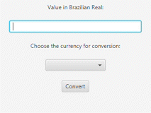

 Alura ONE - Oracle Next Education

  
 

  <h2>Funcionalidades</h2>

## Descrição do projeto 

  Conversor de moedas simples, utilizando Java e JavaFx para criação de telas simples. As cotações estão funcionando em tempo real usando API: (https://docs.awesomeapi.com.br/api-de-moedas).

## Funcionalidades

:heavy_check_mark: Conversão de Real Dollar

:heavy_check_mark: Conversão de Real Euro

:heavy_check_mark: Conversão de Real para Libra Esterlina

:heavy_check_mark: Conversão de Real Peso argentino

:heavy_check_mark: Conversão de Real Peso chileno

  

